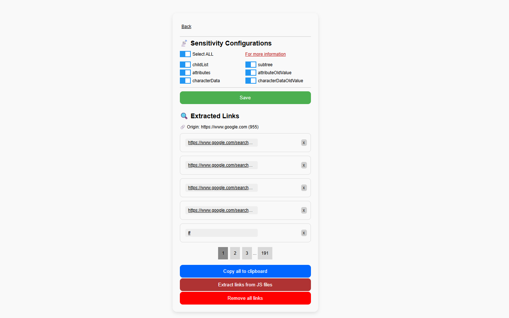

# Automatic Link Extractor

Automatic Link Extractor is a Chrome extension that observes DOM changes on the current page and automatically extracts links whenever the DOM updates. It can collect links from attributes such as `src`, `href`, `action`, and more. Additionally, it allows users to extract links from JavaScript files through its dashboard.

## Features

* Extract links from DOM (`src`, `href`, `action`, etc.)
* Extract links from JavaScript files
* Adjustable DOM observer sensitivity

## Installation

1. Clone or download this repository.
2. Open **Chrome** and go to `chrome://extensions/`.
3. Enable **Developer mode** (toggle on top-right).
4. Click **Load unpacked** and select the project folder.

## Usage

1. Install the extension as described above.
2. Add your target website to the extension’s **origins list**.
3. Configure the observer sensitivity according to your needs.
4. The extension will automatically extract links as the DOM changes.

## Screenshots

## License

This project is licensed under the MIT License – feel free to use, modify, and distribute it.
